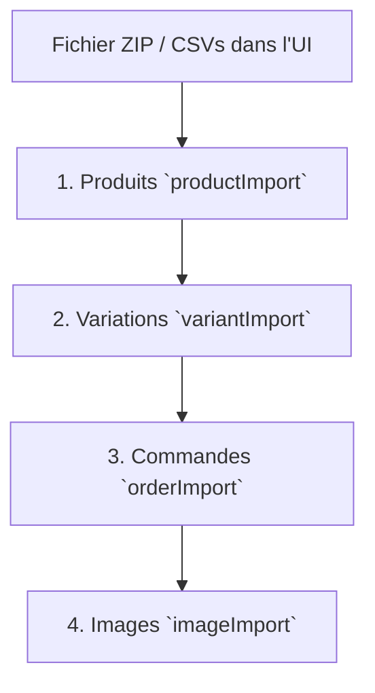

# Guide de l'Importation de Données PrestaShop

Ce guide détaille l'architecture, le fonctionnement, la sécurité et les structures de données de l'ensemble des modules d'importation de l'application. 

L'importation est découpée en services spécialisés situés dans le dossier [src/service/](file:///home/rahaj/projet/vue/src/service) et pilotée graphiquement par le composant [ImportView.vue](file:///home/rahaj/projet/vue/src/view/backoffice/ImportView.vue).

---

## 📌 1. Vue d'ensemble & Flux de Séquence

L'importation de données dans une boutique d'e-commerce suit un ordre logique strict dicté par les dépendances de base de données. Vous ne pouvez pas importer une déclinaison pour un produit qui n'existe pas, ni une commande pour un produit ou un client non répertorié.

Le point d'entrée d'importation global `startAllImports` dans [ImportView.vue](file:///home/rahaj/projet/vue/src/view/backoffice/ImportView.vue) orchestre ce flux dans l'ordre suivant :



Chaque étape dispose de ses propres **barrières de sécurité** (validation des formats, unicité des clés) et de son **mécanisme de rollback (restauration)**. Si une étape échoue de manière critique, le système nettoie automatiquement ce qu'il vient de créer pour éviter de laisser la base de données de PrestaShop dans un état corrompu.

---

## 📦 2. L'Import de Produits (`productImport.js`)

Ce module gère la création des fiches produits de base dans PrestaShop à partir d'un fichier CSV.

* **Fichier source :** [productImport.js](file:///home/rahaj/projet/vue/src/service/productImport.js)
* **Fonctions exportées :**
  * `processProductImport(data, logCallback)` : Traitement de la liste de produits.
  * `rollbackProducts(logCallback)` : Nettoyage global de sécurité en cas d'erreur fatale.

### 📋 Structure attendue du CSV
Les en-têtes du CSV sont nettoyés (espaces supprimés, convertis en minuscules). Les colonnes obligatoires et facultatives sont :

| Colonne CSV | Rôle | Format / Contrainte | Exemple |
| :--- | :--- | :--- | :--- |
| **`nom`** | Nom affiché du produit | Obligatoire, non vide | `T-Shirt Antigravity` |
| **`reference`** | Référence unique du produit | Obligatoire, sert de clé de liaison | `TS_ANTIGRAV_01` |
| **`prix_ttc`** | Prix de vente public toutes taxes comprises | Nombre décimal strictement positif | `19.99` ou `19,99` |
| **`taxe`** | Taux de taxe à appliquer | Nombre décimal positif (ex: `20` ou `20%`) | `20%` |
| **`categorie`** | Catégorie du produit | Nom de la catégorie (créée si inexistante) | `Vêtements` |
| **`prix_achat`** | Prix d'achat HT (Wholesale Price) | Optionnel, décimal (défaut : `0`) | `8.50` |
| **`date_availability_produit`** | Date de mise à disposition | Format strict `DD/MM/YYYY` | `24/12/2026` |

### 🛡️ Barrières de Sécurité (Safety Guards)
1. **Validation Globale des Colonnes :** Si l'une des colonnes de base (`date_availability_produit`, `nom`, `reference`, `prix_ttc`, `taxe`, `categorie`, `prix_achat`) est manquante, l'import est annulé immédiatement avant d'écrire en BDD.
2. **Validation par ligne :** 
   * `nom` et `reference` manquants ou vides -> Ligne ignorée.
   * `prix_ttc` négatif ou invalide -> Ligne ignorée.
   * `taxe` négative ou invalide -> Ligne ignorée.
   * `date_availability_produit` ne respectant pas exactement l'expression régulière `/^\d{2}\/\d{2}\/\d{4}$/` -> Ligne ignorée.

### ⚙️ Fonctionnement interne pas-à-pas
1. **Calcul du prix HT :** `prix_ht = prix_ttc / (1 + taxe / 100)`. PrestaShop stocke les prix en HT.
2. **Résolution des Taxes :** Le script recherche dans PrestaShop un groupe de règles de taxe (`tax_rule_groups`) dont l'une des règles correspond exactement au taux spécifié (ex: `20`).
   * 💡 **Optimisation (Cache) :** Les résultats sont conservés dans un cache local (`taxCache`) pour éviter de saturer l'API avec des requêtes redondantes.
3. **Résolution / Création de Catégorie :**
   * Recherche de la catégorie par son nom.
   * Si elle n'existe pas, création de la catégorie sous le parent `2` (Catégorie Accueil par défaut) avec génération automatique de son `link_rewrite` (ex: `Vêtements` -> `vetements`).
   * 💡 **Optimisation (Cache) :** Stockage des IDs dans `categoryCache`.
4. **Création du Produit :** Envoi d'un payload XML en `POST` à `/products`. Le produit est créé actif (`active: 1`, `state: 1`) et lié à sa catégorie par défaut.
5. **Forçage de la date de disponibilité :**
   * PrestaShop ne permet pas toujours de fixer la date de disponibilité au premier POST en toute fiabilité. Un `PUT` ultérieur est donc effectué à `/products/{id}`.
   * > [!IMPORTANT]
     > **Correction XML Error 127 :** Avant d'exécuter le `PUT`, le script supprime explicitement les champs en lecture seule renvoyés par l'API (`manufacturer_name`, `quantity`, `id_default_image`, `id_default_combination`, `position_in_category`, `type`). Sans cette purge, l'API de PrestaShop renvoie une erreur de schéma fatale (erreur 127).

---

## 🎨 3. L'Import de Variations (`variantImport.js`)

Ce module gère les déclinaisons des produits (ex: tailles, couleurs) et la synchronisation de leurs stocks et prix spécifiques.

* **Fichier source :** [variantImport.js](file:///home/rahaj/projet/vue/src/service/variantImport.js)
* **Fonctions exportées :**
  * `processVariantImport(data, logCallback)` : Traitement des lignes de déclinaisons.
  * `rollbackDeclinaison(logCallback)` : Nettoyage des attributs et déclinaisons créées.

### 📋 Structure attendue du CSV
| Colonne CSV | Rôle | Format | Exemple |
| :--- | :--- | :--- | :--- |
| **`reference`** | Référence du produit parent | Obligatoire (doit exister en base) | `TS_ANTIGRAV_01` |
| **`specificité`** | Nom du groupe d'attributs | Optionnel (ex: Taille, Couleur) | `Taille` |
| **`karazany`** | Valeur de l'attribut | Optionnel (ex: M, L, XL, Rouge) | `XL` |
| **`stock_initial`**| Quantité de stock physique à définir | Entier positif ou nul | `50` |
| **`prix_vente_ttc`**| Prix final TTC de cette variation | Nombre décimal positif | `22.50` |

### ⚙️ Fonctionnement interne pas-à-pas

#### Cas A : Produit Simple (Pas de `specificité` ni de `karazany`)
Si la ligne ne contient aucune spécificité ou valeur, le script la traite comme la mise à jour de stock d'un produit simple existant :
1. Recherche du stock existant via le endpoint `/stock_availables` lié au `parentProductId` et à la déclinaison `0`.
2. Calcul de la différence entre le nouveau stock et l'ancien stock (`delta = stockInitial - oldQty`).
3. Mise à jour de la quantité via un `PUT` XML sur `/stock_availables/{id}`.
4. **Historique des stocks :** Si le delta est différent de 0, enregistrement d'un mouvement de stock via un `POST` sur `/stock_movements` (ID raison : `11` si positif, `12` si négatif).

#### Cas B : Produit avec Déclinaisons (Variations)
Si `specificité` et `karazany` sont renseignés :
1. **Résolution du Groupe d'Attributs (`product_options`) :** Recherche par nom (ex: "Taille"). S'il n'existe pas, il est créé en mode `select`. Cache local : `optionCache`.
2. **Résolution de la Valeur d'Attribut (`product_option_values`) :** Recherche sous le groupe d'attribut résolu (ex: "XL"). Si elle n'existe pas, création de la valeur sous ce groupe. Cache local : `optionValueCache`.
3. **Calcul de l'impact sur le prix :** PrestaShop stocke l'impact financier de la déclinaison relativement au prix de base du produit parent.
   $$\text{Price Impact} = \text{prixVenteTTC} - \text{prixParentHT}$$
4. **Création de la combinaison :** Envoi d'un XML `POST` à `/combinations` liant le produit parent à la valeur de l'attribut, avec une référence finale formatée sous la forme `${reference}_${karazany}` (ex: `TS_ANTIGRAV_01_XL`).
5. **Synchronisation du Stock de Déclinaison :**
   * Recherche de l'entité stock disponible associée à cette déclinaison (`id_product_attribute` = `combinationId`).
   * Mise à jour de la quantité et insertion d'un mouvement de stock historique dans `/stock_movements`.

> [!TIP]
> **Hack pour Dashboard (`StockEvolution.vue`) :**
> Lors de l'écriture des mouvements de stock dans PrestaShop, les champs natifs de liaison d'une déclinaison sont très limités. Pour permettre au tableau de bord d'évolution des stocks d'afficher proprement les noms des produits et déclinaisons, le script réutilise astucieusement les champs suivants lors du `POST` `/stock_movements` :
> * `id_order` stocke l'ID du produit parent (`parentProductId`).
> * `id_supply_order` stocke l'ID de la déclinaison (`attributeId`).

---

## 🛒 4. L'Import de Commandes (`orderImport.js`)

Ce module convertit des lignes d'achats en fiches clients, paniers d'achat complets et historiques de commandes avec ajustement automatique des inventaires.

* **Fichier source :** [orderImport.js](file:///home/rahaj/projet/vue/src/service/orderImport.js)
* **Fonctions exportées :**
  * `processOrderImport(data, logCallback)` : Traitement et création des paniers et commandes.
  * `rollbackOrders(logCallback)` : Nettoyage des commandes, adresses et clients importés.

### 📋 Structure attendue du CSV
| Colonne CSV | Rôle | Format / Contrainte | Exemple |
| :--- | :--- | :--- | :--- |
| **`email`** | Email d'identification client | Obligatoire, clé d'unicité | `client@gmail.com` |
| **`nom`** | Nom complet du client | Optionnel (défaut : "Client") | `Dupont` |
| **`pwd`** | Mot de passe de son compte | Optionnel (défaut : "123456789") | `secret123` |
| **`adresse`** | Adresse physique de livraison | Optionnel (défaut : "Antananarivo") | `12 Rue des Alouettes` |
| **`date`** | Date de la commande | Format `DD/MM/YYYY` (défaut : aujourd'hui) | `18/05/2026` |
| **`etat`** | Statut final de la commande | Voir tableau des états ci-dessous | `payé` ou `abandonné` |
| **`achat`** | Liste structurée des produits achetés | Syntaxe spécifique sous forme de liste de tuples | `[(REF1;QTY1;VAR1),(REF2;QTY2;VAR2)]` |

### ⚙️ Fonctionnement interne pas-à-pas

#### 1. Résolution du Compte Client & de l'Adresse
* Recherche du client par son `email` dans PrestaShop. S'il n'existe pas, création d'un compte client (`/customers`) dans le groupe client standard (ID `3`).
* Recherche ou création d'une adresse de livraison associée à ce client (`/addresses`) avec le pays par défaut (ID `8`).

#### 2. Analyse des achats et calculs financiers
Pour chaque élément présent dans le tuple `achat` :
* Recherche du produit parent par sa référence.
* Si une `variante` est fournie dans le tuple, recherche de la combinaison associée (référence `${reference}_${variante}`) pour obtenir son identifiant d'attribut (`product_attribute_id`) et sommer son impact financier au prix HT de base du produit.
* Génération à la volée des blocs XML de panier (`<cart_row>`) et de commande (`<order_row>`).

#### 3. Création du Panier
Un panier d'achat est d'abord instancié dans PrestaShop via un `POST` à `/carts` contenant les associations de lignes de produits.

#### 4. Traitement selon l'état de commande (`etat`)
Le script analyse la colonne `etat` :

| Valeur de `etat` dans le CSV | Action système | Statut PrestaShop final |
| :--- | :--- | :--- |
| **Vide ou absent** | Sauvegarde comme **Panier Abandonné** | Aucun (Le panier reste dans `/carts` sans commande associée) |
| **Contient "accept" ou "pay"** (ex: `payé`) | Commande validée et facturée | **État ID 2 :** "Paiement accepté" |
| **Autre valeur** (ex: `annulé`) | Commande annulée | **État ID 6 :** "Annulée" |

Si une commande doit être générée :
1. **Création de la commande :** Envoi d'un XML `POST` à `/orders` lié au `cartId` précédemment créé avec génération d'une référence aléatoire unique de 9 lettres majuscules (ex: `XPQZRTWLM`).
2. **Forçage du statut d'historique :** Envoi d'un payload à `/order_histories` pour ancrer l'état (ID `2` ou `6`).
3. **Mise à jour des stocks (Mouvements de stock) :** Pour chaque produit acheté, le système enregistre une sortie de stock physique (`sign: -1`, ID raison : `3` - Commande client) en utilisant le même Hack dashboard (produit stocké dans `id_order` et déclinaison stockée dans `id_supply_order`).
4. **Sécurité d'annulation (Panier fantôme) :** Si la création de la commande échoue en plein vol, le script supprime immédiatement le panier temporaire créé pour éviter d'encombrer la base de données de "paniers fantômes".

---

## 🖼️ 5. L'Import d'Images (`imageImport.js`)

Ce module permet d'associer en masse des fichiers images (fichiers JPG/PNG) aux produits enregistrés en faisant correspondre le nom du fichier image avec la référence produit.

* **Fichier source :** [imageImport.js](file:///home/rahaj/projet/vue/src/service/imageImport.js)
* **Fonction exportée :**
  * `processImageImport(zipFile, logCallback)` : Chargement et décompression du fichier ZIP, puis liaison des images aux produits.

### 📋 Format attendu du fichier ZIP
Vous devez importer un fichier `.zip` standard. Les fichiers d'images internes doivent être nommés précisément d'après la référence de leur produit.

* **Exemple de structure ZIP :**
  * `TS_ANTIGRAV_01.jpg` -> Lié automatiquement au produit ayant la référence `TS_ANTIGRAV_01`.
  * `JEAN_02.png` -> Lié automatiquement au produit ayant la référence `JEAN_02`.

### ⚙️ Fonctionnement interne pas-à-pas
1. **Décompression :** Utilisation de la bibliothèque `JSZip` pour charger le fichier zip en mémoire de manière asynchrone.
2. **Filtrage de fichiers :** Le script ignore automatiquement les dossiers vides ainsi que les fichiers systèmes parasites de macOS (ex: préfixés par `__MACOSX/`).
3. **Extraction de la référence :** La référence produit correspond simplement au nom du fichier débarrassé de son extension de fichier :
   $$\text{Nom du fichier} = \text{"TS\_ANTIGRAV\_01.jpg"} \implies \text{Référence recherchée} = \text{"TS\_ANTIGRAV\_01"}$$
4. **Résolution du produit ID :** Requête API à `/products?filter[reference]={reference}&display=[id]`. Cache local : `productCache`.
5. **Upload binaire :** L'image est extraite du zip sous forme de `Blob`, encapsulée dans un objet `File` JavaScript standard, puis envoyée à PrestaShop via un appel multipart binaire `postImage` sur le endpoint `/images/products/{productId}`.

---

## 🔄 6. Le Moteur de Rollback & Reset (`resetService.js` / `resetTargets.js`)

La sécurité et l'intégrité des bases de données sont cruciales. En cas de coupure réseau ou d'incohérence de données durant l'import, le système intègre un moteur de nettoyage automatique qui évite les doublons et les imports partiels corrompus.

* **Fichiers sources :** [resetService.js](file:///home/rahaj/projet/vue/src/service/resetService.js) et [resetTargets.js](file:///home/rahaj/projet/vue/src/service/resetTargets.js)

### 📋 Modèle de données d'une cible de réinitialisation (`resetTargets`)
Chaque entité de base de données à nettoyer est déclarée sous forme d'objet de configuration :

```javascript
{
  key: 'products',
  label: 'Produits',
  endpoint: '/products',
  collectionKey: 'products',
  itemKey: 'product',
  defaultSelected: true,
  skipIds: []
}
```

* **`skipIds` (Identifiants protégés) :** Permet d'immuniser certaines données critiques d'origine contre le nettoyage (ex: Le client administrateur d'ID `1`, ou les catégories indispensables ID `1` (Root) et `2` (Home/Accueil)).

### ⚠️ Piège classique de l'API PrestaShop sur les Mouvements de Stock
> [!WARNING]
> Dans le fichier de configuration des cibles de réinitialisation ([resetTargets.js](file:///home/rahaj/projet/vue/src/service/resetTargets.js#L147-L153)), le pluriel de l'API PrestaShop pour les mouvements de stock est asymétrique et constitue un piège classique :
> * Le endpoint individuel est `/stock_movements`.
> * La clé de collection de l'API XML est **`stock_mvts`** (avec un "s" et raccourcie), tandis que l'objet unitaire est `stock_mvt`.
> 
> Le script résout parfaitement cette exception grâce au paramétrage minutieux de sa clé de collection :
> `collectionKey: 'stock_mvts'`.

---

## 🔍 7. Guide Complet des Syntaxes & Formats

Cette section documente de manière exhaustive la syntaxe exacte de tous les fichiers d'entrée et des payloads XML échangés avec PrestaShop.

### 📄 A. Syntaxe & Exemples des Fichiers CSV

#### 1. Fichier `produits.csv`
Le fichier de définition des produits de base. Toutes les en-têtes sont insensibles à la casse.

```csv
date_availability_produit,nom,reference,prix_ttc,taxe,categorie,prix_achat
18/05/2026,T-shirt Premium Antigravity,TS_PREM_01,24.99,20%,Vêtements,10.50
25/12/2026,Casquette Vintage,CASQ_VINT_02,15.00,5.5,Accessoires,4.20
,Mug Collector,MUG_COLL_03,9.99,20,Maison,2.00
```
* **Notes de syntaxe :**
  * La date doit respecter le masque `JJ/MM/AAAA` (ou être vide).
  * Les nombres décimaux (prix et taxe) acceptent le point `.` et la virgule `,` comme séparateur.
  * Le symbole `%` dans la taxe est nettoyé automatiquement par le parseur.

#### 2. Fichier `variations.csv`
Lie des attributs spécifiques à des produits déjà importés et initialise leurs stocks physiques.

```csv
reference,specificité,karazany,stock_initial,prix_vente_ttc
TS_PREM_01,Taille,S,15,24.99
TS_PREM_01,Taille,M,30,24.99
TS_PREM_01,Taille,L,25,26.50
MUG_COLL_03,,,100,9.99
```
* **Notes de syntaxe :**
  * Pour un **produit simple** sans déclinaison (ex: `MUG_COLL_03`), laissez les colonnes `specificité` et `karazany` **vides**. Le script comprendra qu'il doit directement mettre à jour l'inventaire physique global de ce produit.
  * Pour les déclinaisons (ex: `TS_PREM_01`), `prix_vente_ttc` représente le prix TTC final de cette déclinaison. Le système se charge de calculer l'écart (impact de prix HT) pour PrestaShop.

#### 3. Fichier `commandes.csv`
Création en masse des comptes clients, adresses, paniers et commandes historiques.

```csv
email,nom,pwd,adresse,date,etat,achat
dupont@gmail.com,Jean Dupont,pwdDupont123,12 Rue de Paris,15/05/2026,payé,[(TS_PREM_01;2;M),(CASQ_VINT_02;1;)]
sansvariant@yahoo.fr,Paul Martin,,45 Avenue de la Gare,,abandonné,[(MUG_COLL_03;5;)]
```

---

### 🧩 B. Décryptage de la syntaxe de la colonne `achat`

La colonne `achat` utilise un formalisme de liste de tuples textuels : `[(REF_1;QTE_1;VAR_1),(REF_2;QTE_2;VAR_2),...]`.

#### Structure d'un tuple unitaire : `(reference;quantite;variante)`
* **`reference`** : Code de référence exact du produit parent (ex: `TS_PREM_01`).
* **`quantite`** : Entier désignant le nombre d'articles commandés (défaut : `1` si invalide).
* **`variante`** : Nom de la variante textuelle (ex: `M`). **Laissez vide si le produit est simple ou n'a pas de déclinaison.** Le point-virgule `;` final reste requis pour maintenir la structure.

#### Exemples de valeurs `achat` analysés par le parseur :

* **Achat unique avec déclinaison :**
  `[(TS_PREM_01;2;M)]`
  * *Interprétation :* 2 T-shirts `TS_PREM_01` en taille `M`.

* **Achat unique sans déclinaison (Produit Simple) :**
  `[(MUG_COLL_03;4;)]` ou `[(MUG_COLL_03;4)]`
  * *Interprétation :* 4 Mugs `MUG_COLL_03`. Notez le point-virgule vide à la fin.

* **Multi-achats combinés :**
  `[(TS_PREM_01;1;S),(CASQ_VINT_02;2;),(MUG_COLL_03;5;)]`
  * *Interprétation :* 1 T-shirt en taille `S` + 2 casquettes simples + 5 mugs simples.

#### Fonctionnement du parseur Regex/Textuel dans le code :
Le script extrait la chaîne comprise entre les crochets `[` et `]`. Puis, il détecte les couples de parenthèses `(...)`. Pour chaque couple, il sépare les données au niveau du caractère point-virgule `;` en nettoyant les éventuels guillemets simples ou doubles parasitaires :
```javascript
// Analyse du contenu : "reference;quantite;variante"
const parts = item.split(';').map(p => p.trim());
const itemParsed = {
  reference: parts[0],             // Ex: "TS_PREM_01"
  quantite: parseInt(parts[1], 10) // Ex: 2
  variante: parts[2] || ""         // Ex: "M" ou ""
};
```

---

### 🌐 C. Syntaxe des Payloads XML de l'API PrestaShop

Tous les échanges avec l'API Web Service de PrestaShop s'effectuent via des structures XML encapsulées. Voici les schémas exacts générés par nos fonctions de service :

#### 1. Création de Produit (`POST` sur `/products`)
```xml
<?xml version="1.0" encoding="UTF-8"?>
<prestashop>
  <product>
    <state>1</state>
    <active>1</active>
    <reference>TS_PREM_01</reference>
    <price>20.825000</price>             <!-- Prix HT calculé -->
    <wholesale_price>10.500000</wholesale_price>
    <id_tax_rules_group>1</id_tax_rules_group> <!-- ID règle de taxe résolu -->
    <id_category_default>3</id_category_default>
    <name>
      <language id="1"><![CDATA[T-shirt Premium Antigravity]]></language>
    </name>
    <link_rewrite>
      <language id="1"><![CDATA[t-shirt-premium-antigravity]]></language>
    </link_rewrite>
    <associations>
      <categories>
        <category>
          <id>3</id>
        </category>
      </categories>
    </associations>
  </product>
</prestashop>
```

#### 2. Création de Déclinaison / Combinaison (`POST` sur `/combinations`)
```xml
<?xml version="1.0" encoding="UTF-8"?>
<prestashop>
  <combination>
    <id_product>42</id_product>           <!-- ID du produit parent -->
    <reference>TS_PREM_01_M</reference>
    <price>0.000000</price>               <!-- Impact de prix HT par rapport au parent -->
    <minimal_quantity>1</minimal_quantity>
    <associations>
      <product_option_values>
        <product_option_value>
          <id>12</id>                     <!-- ID de la valeur d'attribut (ex: 'M') -->
        </product_option_value>
      </product_option_values>
    </associations>
  </combination>
</prestashop>
```

#### 3. Ajustement de Stock Physique (`PUT` sur `/stock_availables/{id}`)
```xml
<?xml version="1.0" encoding="UTF-8"?>
<prestashop>
  <stock_available>
    <id><![CDATA[104]]></id>
    <id_product><![CDATA[42]]></id_product>
    <id_product_attribute><![CDATA[15]]></id_product_attribute> <!-- ID déclinaison, ou 0 si simple -->
    <id_shop><![CDATA[1]]></id_shop>
    <id_shop_group><![CDATA[0]]></id_shop_group>
    <quantity><![CDATA[30]]></quantity>                         <!-- Nouveau stock absolu -->
    <depends_on_stock><![CDATA[0]]></depends_on_stock>
    <out_of_stock><![CDATA[2]]></out_of_stock>
    <location><![CDATA[]]></location>
  </stock_available>
</prestashop>
```

#### 4. Tracé d'Historique de Mouvement de Stock (`POST` sur `/stock_movements`)
```xml
<?xml version="1.0" encoding="UTF-8"?>
<prestashop>
  <stock_mvt>
    <!-- Le Hack Dashboard : id_order et id_supply_order stockent pId et attributeId -->
    <id_order><![CDATA[42]]></id_order>                  <!-- Produit ID -->
    <id_supply_order><![CDATA[15]]></id_supply_order>    <!-- Déclinaison ID -->
    <id_employee><![CDATA[1]]></id_employee>
    <id_stock><![CDATA[0]]></id_stock>
    <id_stock_mvt_reason><![CDATA[11]]></id_stock_mvt_reason> <!-- Raison (11: Ajout, 12: Diminution, 3: Commande) -->
    <physical_quantity><![CDATA[15]]></physical_quantity>     <!-- Quantité modifiée (valeur absolue) -->
    <sign><![CDATA[1]]></sign>                                <!-- 1 pour positif, -1 pour retrait -->
    <price_te><![CDATA[0.000000]]></price_te>
    <date_add><![CDATA[2026-05-18 08:20:00]]></date_add>
  </stock_mvt>
</prestashop>
```

#### 5. Panier d'Achat (`POST` sur `/carts`)
```xml
<?xml version="1.0" encoding="UTF-8"?>
<prestashop>
  <cart>
    <id_customer><![CDATA[7]]></id_customer>
    <id_address_delivery><![CDATA[14]]></id_address_delivery>
    <id_address_invoice><![CDATA[14]]></id_address_invoice>
    <id_currency><![CDATA[1]]></id_currency>
    <id_lang><![CDATA[1]]></id_lang>
    <associations>
      <cart_rows>
        <cart_row>
          <id_product><![CDATA[42]]></id_product>
          <id_product_attribute><![CDATA[15]]></id_product_attribute>
          <id_address_delivery><![CDATA[14]]></id_address_delivery>
          <quantity><![CDATA[2]]></quantity>
        </cart_row>
      </cart_rows>
    </associations>
  </cart>
</prestashop>
```

#### 6. Commande Finale (`POST` sur `/orders`)
```xml
<?xml version="1.0" encoding="UTF-8"?>
<prestashop>
  <order>
    <id_address_delivery><![CDATA[14]]></id_address_delivery>
    <id_address_invoice><![CDATA[14]]></id_address_invoice>
    <id_cart><![CDATA[92]]></id_cart>
    <id_currency><![CDATA[1]]></id_currency>
    <id_lang><![CDATA[1]]></id_lang>
    <id_customer><![CDATA[7]]></id_customer>
    <id_carrier><![CDATA[1]]></id_carrier>
    <id_shop_group><![CDATA[1]]></id_shop_group>
    <id_shop><![CDATA[1]]></id_shop>
    <current_state><![CDATA[2]]></current_state>                 <!-- Statut (2: Payé, 6: Annulé) -->
    <reference><![CDATA[XPQZRTWLM]]></reference>                 <!-- Référence générée aléatoirement -->
    <module><![CDATA[ps_wirepayment]]></module>
    <payment><![CDATA[Paiement importé]]></payment>
    <total_paid><![CDATA[49.980000]]></total_paid>
    <total_paid_real><![CDATA[49.980000]]></total_paid_real>
    <total_products><![CDATA[49.980000]]></total_products>
    <total_products_wt><![CDATA[49.980000]]></total_products_wt>
    <total_shipping><![CDATA[0.000000]]></total_shipping>
    <total_shipping_tax_incl><![CDATA[0.000000]]></total_shipping_tax_incl>
    <total_shipping_tax_excl><![CDATA[0.000000]]></total_shipping_tax_excl>
    <total_discounts><![CDATA[0.000000]]></total_discounts>
    <total_wrapping><![CDATA[0.000000]]></total_wrapping>
    <conversion_rate><![CDATA[1.000000]]></conversion_rate>
    <date_add><![CDATA[2026-05-18 12:00:00]]></date_add>
    <date_upd><![CDATA[2026-05-18 12:00:00]]></date_upd>
    <associations>
      <order_rows>
        <order_row>
          <product_id><![CDATA[42]]></product_id>
          <product_attribute_id><![CDATA[15]]></product_attribute_id>
          <product_quantity><![CDATA[2]]></product_quantity>
          <product_name><![CDATA[T-shirt Premium Antigravity - M]]></product_name>
          <product_reference><![CDATA[TS_PREM_01]]></product_reference>
          <product_price><![CDATA[20.825000]]></product_price>
          <unit_price_tax_incl><![CDATA[24.990000]]></unit_price_tax_incl>
          <unit_price_tax_excl><![CDATA[20.825000]]></unit_price_tax_excl>
        </order_row>
      </order_rows>
    </associations>
  </order>
</prestashop>
```

---

## 🛠️ 8. Bonnes pratiques d'utilisation dans l'Interface Utilisateur

Toutes ces fonctions d'importation sont pilotées directement depuis l'interface [ImportView.vue](file:///home/rahaj/projet/vue/src/view/backoffice/ImportView.vue). 

Pour lancer un import global propre et éviter les conflits d'indexation :
1. **Étape 1 :** Déposez le fichier CSV des produits.
2. **Étape 2 :** Déposez le fichier CSV des variations (contenant les attributs et stocks physiques).
3. **Étape 3 :** Déposez le fichier CSV des commandes (contenant le détail des ventes).
4. **Étape 4 :** Déposez l'archive ZIP des images produits.
5. **Étape 5 :** Cliquez sur **"Lancer l'import"**. Le journal des logs console s'affiche en temps réel avec un code couleur :
   * <span style="color:#60a5fa; font-weight:bold;">Bleu (Info) :</span> Progression des étapes, appels API.
   * <span style="color:#4ade80; font-weight:bold;">Vert (Success) :</span> Enregistrement validé, entité PrestaShop créée.
   * <span style="color:#f87171; font-weight:bold;">Rouge (Error) :</span> Donnée erronée ou refusée par PrestaShop. Déclenche le rollback de protection.
